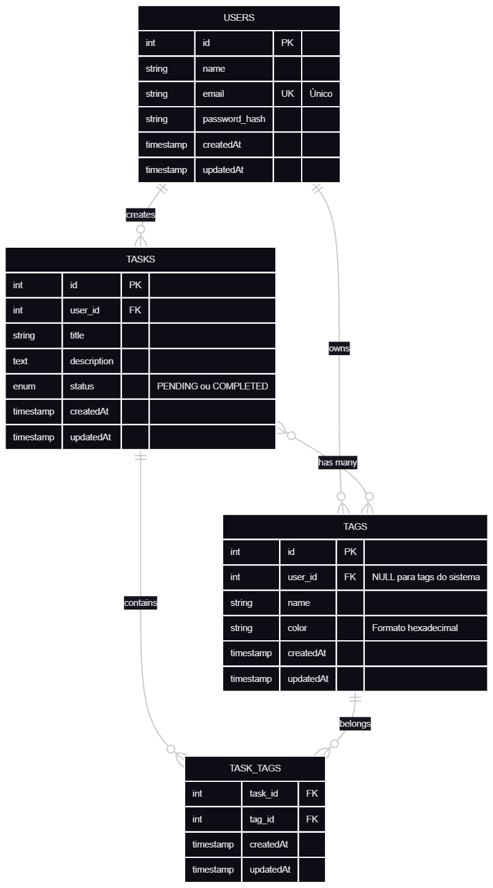

# 📋 Task Manager API - ZettaLab Challenge

[](https://nodejs.org/)
[](https://expressjs.com/)
[](https://www.postgresql.org/)
[](https://jestjs.io/)
[](https://github.com/facebook/jest)
[](LICENSE)

> 🌐 **API em Produção:** [https://taskmanager-api-zettalab.onrender.com](https://taskmanager-api-zettalab.onrender.com)  
> 📚 **Documentação Interativa:** [https://taskmanager-api-zettalab.onrender.com/api-docs](https://taskmanager-api-zettalab.onrender.com/api-docs)

## 📝 Descrição

API RESTful completa para gerenciamento de tarefas (To-Do List) desenvolvida como parte do desafio técnico da ZettaLab. A aplicação oferece autenticação JWT, CRUD completo de tarefas, sistema híbrido de tags (sistema + personalizadas), e relacionamentos N:N entre entidades.

### ✨ Principais Diferenciais

- 🔐 **Autenticação segura** com JWT e hash de senhas (bcrypt)
- 🏷️ **Sistema híbrido de tags**: 8 tags predefinidas + tags personalizadas por usuário
- 🔍 **Filtros avançados**: busca por status e tags
- 📚 **Documentação Swagger** completa e interativa
- ✅ **88% de cobertura de testes** com Jest
- 🎨 **Validação de entrada** com Yup
- 🐳 **Docker Compose** para ambiente de desenvolvimento

---

## 🌳 Estrutura do Projeto

```
desafio-zettalab-ii-2025/
├── src/
│   ├── config/
│   │   ├── auth.js                    # Configurações do JWT
│   │   └── database.js                # Configurações do Sequelize
│   ├── controllers/
│   │   ├── SessionController.js       # Login/Autenticação
│   │   ├── TaskController.js          # CRUD de tarefas
│   │   ├── TagController.js           # CRUD de tags
│   │   └── UserController.js          # Criação de usuários
│   ├── database/
│   │   ├── index.js                   # Inicialização dos modelos e relacionamentos
│   │   └── seedSystemTags.js          # Seeds das tags do sistema
│   ├── middlewares/
│   │   └── auth.js                    # Middleware de autenticação JWT
│   ├── models/
│   │   ├── Tag.js                     # Model de Tags
│   │   ├── Task.js                    # Model de Tarefas
│   │   └── User.js                    # Model de Usuários
│   ├── validators/
│   │   ├── TagValidator.js            # Validação de tags (Yup)
│   │   ├── TaskValidator.js           # Validação de tarefas (Yup)
│   │   └── UserValidator.js           # Validação de usuários (Yup)
│   ├── app.js                         # Configuração do Express
│   ├── routes.js                      # Definição de rotas + Swagger Docs
│   └── server.js                      # Inicialização do servidor
├── tests/
│   ├── helpers/
│   │   ├── factories.js               # Factories para criação de dados de teste
│   │   └── testDb.js                  # Configuração do banco SQLite in-memory
│   ├── integration/
│   │   ├── auth.test.js               # Testes de autenticação (10 testes)
│   │   ├── tasks.test.js              # Testes de tarefas (16 testes)
│   │   └── tags.test.js               # Testes de tags (9 testes)
│   ├── unit/
│   │   └── config.test.js             # Testes unitários (3 testes)
│   └── setup.js                       # Configuração global dos testes
├── .env.example                       # Exemplo de variáveis de ambiente
├── .gitignore
├── database_schema.sql                # Schema SQL do banco de dados
├── docker-compose.yml                 # Docker Compose para PostgreSQL
├── jest.config.js                     # Configuração do Jest
├── package.json
├── swagger.js                         # Configuração do Swagger
└── README.md
```

---

## 🚀 Funcionalidades

### Autenticação
- ✅ Registro de novos usuários com validação
- ✅ Login com geração de token JWT
- ✅ Proteção de rotas com middleware de autenticação
- ✅ Hash seguro de senhas com bcryptjs

### Gerenciamento de Tarefas
- ✅ Criar tarefa (com ou sem tags)
- ✅ Listar tarefas do usuário autenticado
- ✅ Filtrar por status (`PENDING` ou `COMPLETED`)
- ✅ Filtrar por tags específicas
- ✅ Atualizar tarefas (título, descrição, status, tags)
- ✅ Deletar tarefas
- ✅ Associação N:N com tags

### Sistema de Tags
- ✅ 8 tags do sistema predefinidas (Urgente, Importante, Trabalho, etc.)
- ✅ Criar tags personalizadas
- ✅ Validação de cor hexadecimal (#RGB ou #RRGGBB)
- ✅ Listar tags disponíveis (sistema + pessoais)
- ✅ Proteção contra duplicação de nomes

---

## 🛠️ Tecnologias Utilizadas

### Backend
- **Node.js** (18.x) - Runtime JavaScript
- **Express** (5.2.1) - Framework web
- **Sequelize** (6.37.7) - ORM para PostgreSQL
- **PostgreSQL** (15+) - Banco de dados relacional

### Autenticação & Segurança
- **jsonwebtoken** (9.0.3) - Geração e validação de JWT
- **bcryptjs** (3.0.3) - Hash de senhas
- **cors** - Controle de acesso CORS

### Validação
- **Yup** (1.7.1) - Validação de schemas

### Documentação
- **Swagger UI Express** (5.0.1) - Interface Swagger
- **Swagger JSDoc** (6.2.8) - Documentação via JSDoc

### Testes
- **Jest** (29.x) - Framework de testes
- **Supertest** - Testes de integração HTTP
- **SQLite3** - Banco in-memory para testes

### Desenvolvimento
- **nodemon** (3.1.11) - Auto-reload em desenvolvimento
- **dotenv** (17.2.3) - Gerenciamento de variáveis de ambiente
- **Docker & Docker Compose** - Containerização do PostgreSQL

---

## 📋 Pré-requisitos

Certifique-se de ter instalado:

- **Node.js** 18.x ou superior
- **npm** 9.x ou superior
- **PostgreSQL** 15+ (ou use Docker Compose)
- **Git**

---

## 🔧 Instalação

### 1. Clone o repositório

```bash
git clone https://github.com/joaogsribeiro/desafio-zettalab-ii-2025.git
cd desafio-zettalab-ii-2025
```

### 2. Instale as dependências

```bash
npm install
```

### 3. Configure as variáveis de ambiente

Copie o arquivo `.env.example` para `.env`:

```bash
cp .env.example .env
```

Edite o arquivo `.env` com suas configurações:

```env
# Banco de Dados
DB_HOST=localhost
DB_PORT=5432
DB_NAME=taskmanager
DB_USER=postgres
DB_PASS=postgres

# Autenticação JWT
JWT_SECRET=seu_segredo_super_secreto_aqui
JWT_EXPIRES_IN=7d

# Servidor
PORT=3000
```

### 4. Inicie o PostgreSQL (via Docker ou local)

#### Opção A: Docker Compose (recomendado)

```bash
docker-compose up -d
```

#### Opção B: PostgreSQL local

Crie o banco de dados manualmente:

```bash
createdb taskmanager
```

Ou via SQL:

```sql
CREATE DATABASE taskmanager;
```

### 5. Execute as migrations/sincronização

O Sequelize criará as tabelas automaticamente na primeira execução. As tags do sistema serão criadas automaticamente ao iniciar o servidor.

---

## ▶️ Como Executar

### Modo Desenvolvimento (com auto-reload)

```bash
npm run dev
```

O servidor estará rodando em: `http://localhost:3000`

### Modo Produção

```bash
npm start
```

---

## 🧪 Testes

### Executar todos os testes

```bash
npm test
```

### Executar testes específicos

```bash
# Apenas testes de autenticação
npm test -- tests/integration/auth.test.js

# Apenas testes de tarefas
npm test -- tests/integration/tasks.test.js

# Apenas testes de tags
npm test -- tests/integration/tags.test.js
```

### Cobertura de testes

```bash
npm test -- --coverage
```

**Resultado atual: 88.02% de cobertura**

```
-----------------------|---------|----------|---------|---------|
File                   | % Stmts | % Branch | % Funcs | % Lines |
-----------------------|---------|----------|---------|---------|
All files              |   88.02 |    88.23 |   81.81 |   89.36 |
 src/controllers       |   80.95 |    93.33 |      75 |   83.16 |
 src/middlewares       |     100 |      100 |     100 |     100 |
 src/models            |   85.71 |       25 |   83.33 |   85.71 |
 src/validators        |     100 |      100 |     100 |     100 |
-----------------------|---------|----------|---------|---------|
```

**38 testes passando:**
- 10 testes de autenticação
- 16 testes de tarefas (CRUD completo)
- 9 testes de tags
- 3 testes de configuração

---

## 📚 Documentação da API (Swagger)

Após iniciar o servidor, acesse a documentação interativa:

```
http://localhost:3000/api-docs
```

A documentação Swagger inclui:
- ✅ Todos os endpoints disponíveis
- ✅ Schemas de request/response
- ✅ Códigos de status HTTP
- ✅ Exemplos de uso
- ✅ Interface para testar os endpoints

---

## 🗄️ Banco de Dados

### Diagrama Entidade-Relacionamento (ER)



> 📄 **Versão editável:** O diagrama em formato Mermaid está disponível em [`docs/er-diagram.md`](docs/er-diagram.md)

**Relacionamentos principais:**
- `Users` → `Tasks` (1:N) - Um usuário possui várias tarefas
- `Users` → `Tags` (1:N) - Um usuário possui várias tags personalizadas
- `Tasks` ↔ `Tags` (N:N) - Tarefas podem ter múltiplas tags, tags podem estar em múltiplas tarefas
- **Tags do Sistema:** Tags com `user_id = NULL` são globais e acessíveis a todos

### Tags do Sistema (Predefinidas)

As seguintes tags são criadas automaticamente ao iniciar o servidor:

| ID | Nome       | Cor     | Tipo    |
|----|------------|---------|---------|
| 1  | Urgente    | #EF4444 | Sistema |
| 2  | Importante | #F59E0B | Sistema |
| 3  | Trabalho   | #3B82F6 | Sistema |
| 4  | Pessoal    | #10B981 | Sistema |
| 5  | Estudo     | #8B5CF6 | Sistema |
| 6  | Lazer      | #EC4899 | Sistema |
| 7  | Saúde      | #14B8A6 | Sistema |
| 8  | Financeiro | #06B6D4 | Sistema |

---

## 📖 Exemplos de Uso

### 1. Criar um novo usuário

```bash
curl -X POST http://localhost:3000/users \
  -H "Content-Type: application/json" \
  -d '{
    "name": "João Silva",
    "email": "joao@example.com",
    "password": "senha123"
  }'
```

**Resposta:**
```json
{
  "msg": "Usuário criado com sucesso!",
  "user": {
    "id": 1,
    "name": "João Silva",
    "email": "joao@example.com",
    "createdAt": "2026-02-03T12:00:00.000Z",
    "updatedAt": "2026-02-03T12:00:00.000Z"
  }
}
```

### 2. Fazer login

```bash
curl -X POST http://localhost:3000/sessions \
  -H "Content-Type: application/json" \
  -d '{
    "email": "joao@example.com",
    "password": "senha123"
  }'
```

**Resposta:**
```json
{
  "user": {
    "id": 1,
    "name": "João Silva",
    "email": "joao@example.com"
  },
  "token": "eyJhbGciOiJIUzI1NiIsInR5cCI6IkpXVCJ9..."
}
```

### 3. Criar uma tarefa com tags

```bash
curl -X POST http://localhost:3000/tasks \
  -H "Content-Type: application/json" \
  -H "Authorization: Bearer SEU_TOKEN_AQUI" \
  -d '{
    "title": "Estudar Node.js",
    "description": "Revisar conceitos de Express",
    "tags": [1, 5]
  }'
```

**Resposta:**
```json
{
  "msg": "Tarefa criada com sucesso",
  "task": {
    "id": 1,
    "user_id": 1,
    "title": "Estudar Node.js",
    "description": "Revisar conceitos de Express",
    "status": "PENDING",
    "tags": [
      {
        "id": 1,
        "name": "Urgente",
        "color": "#EF4444"
      },
      {
        "id": 5,
        "name": "Estudo",
        "color": "#8B5CF6"
      }
    ],
    "createdAt": "2026-02-03T12:00:00.000Z",
    "updatedAt": "2026-02-03T12:00:00.000Z"
  }
}
```

### 4. Listar tarefas com filtros

```bash
# Listar todas as tarefas
curl http://localhost:3000/tasks \
  -H "Authorization: Bearer SEU_TOKEN_AQUI"

# Filtrar por status PENDING
curl http://localhost:3000/tasks?status=PENDING \
  -H "Authorization: Bearer SEU_TOKEN_AQUI"

# Filtrar por tag específica
curl http://localhost:3000/tasks?tag_id=1 \
  -H "Authorization: Bearer SEU_TOKEN_AQUI"
```

### 5. Criar uma tag personalizada

```bash
curl -X POST http://localhost:3000/tags \
  -H "Content-Type: application/json" \
  -H "Authorization: Bearer SEU_TOKEN_AQUI" \
  -d '{
    "name": "Projeto X",
    "color": "#9333EA"
  }'
```

**Resposta:**
```json
{
  "msg": "Tag criada com sucesso",
  "tag": {
    "id": 9,
    "name": "Projeto X",
    "color": "#9333EA",
    "user_id": 1,
    "createdAt": "2026-02-03T12:00:00.000Z",
    "updatedAt": "2026-02-03T12:00:00.000Z"
  },
  "created": true
}
```

### 6. Atualizar uma tarefa

```bash
curl -X PUT http://localhost:3000/tasks/1 \
  -H "Content-Type: application/json" \
  -H "Authorization: Bearer SEU_TOKEN_AQUI" \
  -d '{
    "status": "COMPLETED"
  }'
```

### 7. Deletar uma tarefa

```bash
curl -X DELETE http://localhost:3000/tasks/1 \
  -H "Authorization: Bearer SEU_TOKEN_AQUI"
```

---

## 🎯 Endpoints Disponíveis

### 🔓 Públicos (sem autenticação)

| Método | Endpoint    | Descrição            |
|--------|-------------|----------------------|
| POST   | `/users`    | Criar novo usuário   |
| POST   | `/sessions` | Login (obter token)  |

### 🔒 Protegidos (requer autenticação)

| Método | Endpoint       | Descrição                      |
|--------|----------------|--------------------------------|
| GET    | `/tasks`       | Listar tarefas do usuário      |
| POST   | `/tasks`       | Criar nova tarefa              |
| PUT    | `/tasks/:id`   | Atualizar tarefa               |
| DELETE | `/tasks/:id`   | Deletar tarefa                 |
| GET    | `/tags`        | Listar tags (sistema + usuário)|
| POST   | `/tags`        | Criar tag personalizada        |

---

## 🔐 Autenticação

A API utiliza **JWT (JSON Web Token)** para autenticação. Para acessar rotas protegidas:

1. Faça login em `/sessions` e obtenha o token
2. Inclua o token no header `Authorization` de todas as requisições:

```
Authorization: Bearer SEU_TOKEN_JWT
```

**Duração do token:** 7 dias (configurável em `.env`)

---

## ⚙️ Scripts Disponíveis

```json
{
  "start": "node src/server.js",           // Execução em produção
  "dev": "nodemon src/server.js",          // Desenvolvimento com auto-reload
  "test": "jest --coverage --detectOpenHandles" // Executar testes com cobertura
}
```

---

## 🐳 Docker

### Iniciar apenas o PostgreSQL

```bash
docker-compose up -d
```

### Parar os serviços

```bash
docker-compose down
```

### Ver logs

```bash
docker-compose logs -f
```

---

## 📄 Licença

Este projeto está sob a licença MIT. Veja o arquivo [LICENSE](LICENSE) para mais detalhes.

---

**Desenvolvido para o desafio técnico beck-end do ZettaLab 2025**
