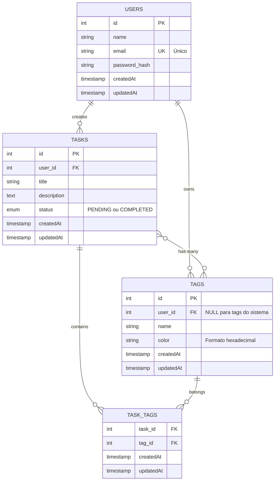

# Diagrama Entidade-Relacionamento (ER)



## Relacionamentos

### 1. Users → Tasks (1:N)
- **Cardinalidade:** Um usuário pode ter várias tarefas
- **Tipo:** Obrigatório (task deve ter user_id)
- **Chave Estrangeira:** `tasks.user_id → users.id`
- **Comportamento:** Quando um usuário é deletado, suas tarefas devem ser tratadas

### 2. Users → Tags (1:N)
- **Cardinalidade:** Um usuário pode ter várias tags personalizadas
- **Tipo:** Opcional (tags do sistema têm user_id = NULL)
- **Chave Estrangeira:** `tags.user_id → users.id`
- **Regra Especial:** Tags com `user_id = NULL` são tags do sistema (globais)

### 3. Tasks ↔ Tags (N:N)
- **Cardinalidade:** Uma tarefa pode ter várias tags, uma tag pode estar em várias tarefas
- **Tipo:** Opcional
- **Tabela Associativa:** `task_tags` (junction table)
- **Chaves Estrangeiras:**
  - `task_tags.task_id → tasks.id`
  - `task_tags.tag_id → tags.id`

## Regras de Negócio

### Users (Usuários)
- ✅ Email deve ser único no sistema
- ✅ Senha é armazenada como hash (bcrypt)
- ✅ Nome é obrigatório
- ✅ Criado em: timestamp automático

### Tasks (Tarefas)
- ✅ Título é obrigatório
- ✅ Status padrão: `PENDING`
- ✅ Status possíveis: `PENDING`, `COMPLETED`
- ✅ Descrição é opcional
- ✅ Usuário só pode ver/editar suas próprias tarefas
- ✅ Tags são opcionais (array de IDs)

### Tags
- ✅ Nome é obrigatório
- ✅ Cor em formato hexadecimal (#RGB ou #RRGGBB)
- ✅ Cor padrão: `#ddd` (se não informada)
- ✅ Tags do sistema: `user_id = NULL`
- ✅ Tags personalizadas: `user_id = ID_DO_USUÁRIO`
- ✅ Usuário não pode criar tag com nome de tag do sistema
- ✅ Comportamento idempotente: tentar criar tag duplicada retorna a existente

### Tags do Sistema (Predefinidas)
| ID | Nome       | Cor     | user_id |
|----|------------|---------|---------|
| 1  | Urgente    | #EF4444 | NULL    |
| 2  | Importante | #F59E0B | NULL    |
| 3  | Trabalho   | #3B82F6 | NULL    |
| 4  | Pessoal    | #10B981 | NULL    |
| 5  | Estudo     | #8B5CF6 | NULL    |
| 6  | Lazer      | #EC4899 | NULL    |
| 7  | Saúde      | #14B8A6 | NULL    |
| 8  | Financeiro | #06B6D4 | NULL    |

## Índices Sugeridos

```sql
-- Performance para queries de tarefas por usuário
CREATE INDEX idx_tasks_user_id ON tasks(user_id);

-- Performance para queries de tags por usuário
CREATE INDEX idx_tags_user_id ON tags(user_id);

-- Performance para filtrar tarefas por status
CREATE INDEX idx_tasks_status ON tasks(status);

-- Performance para joins na tabela associativa
CREATE INDEX idx_task_tags_task_id ON task_tags(task_id);
CREATE INDEX idx_task_tags_tag_id ON task_tags(tag_id);

-- Garantir unicidade de email
CREATE UNIQUE INDEX idx_users_email ON users(email);
```